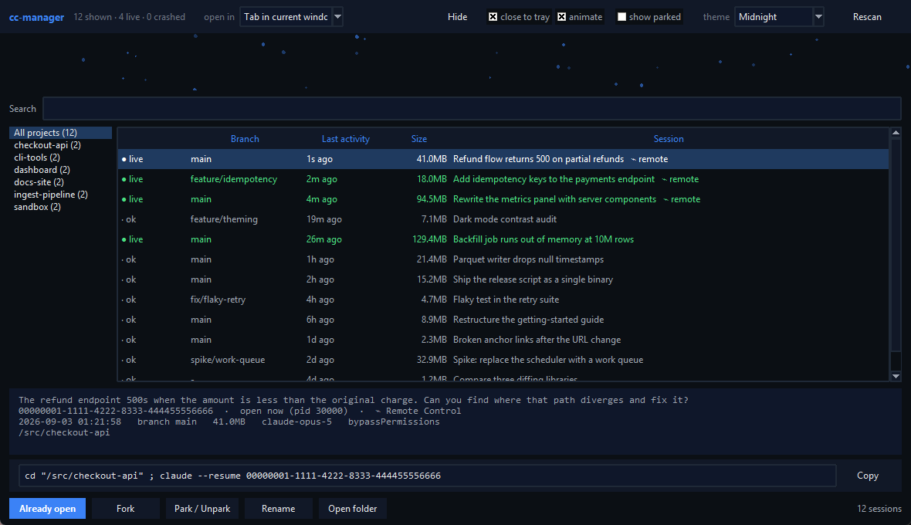
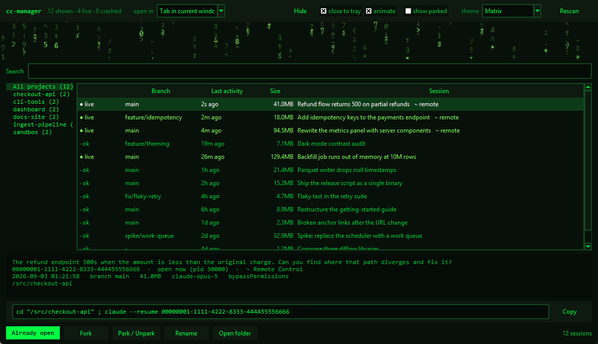
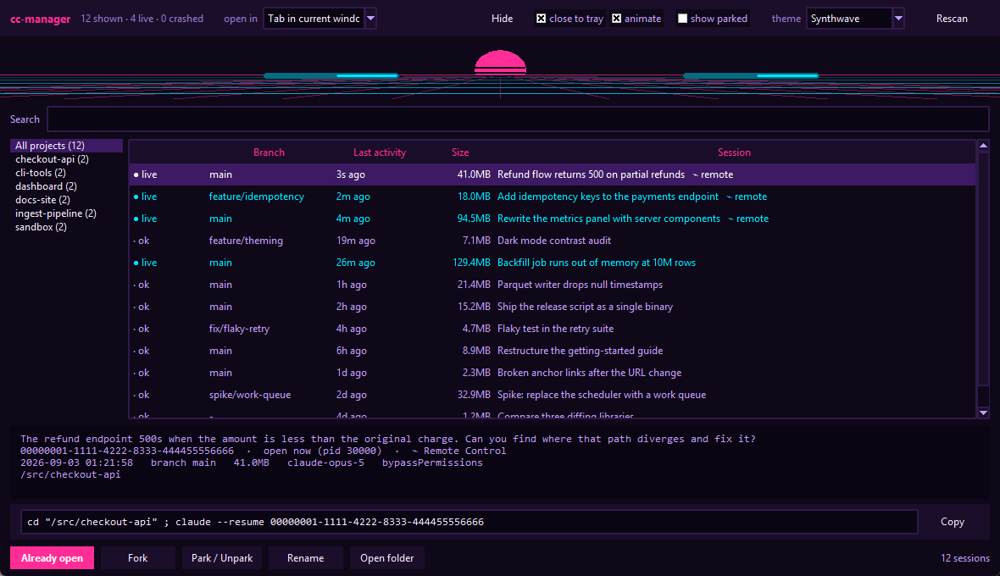
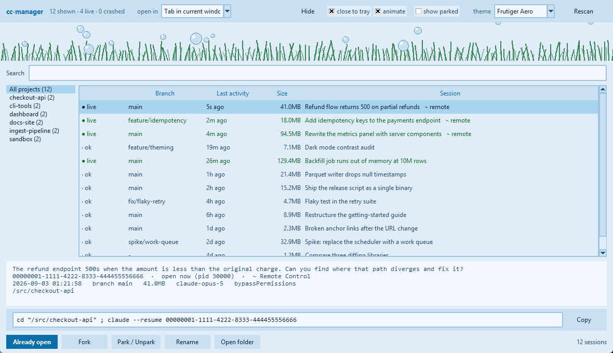
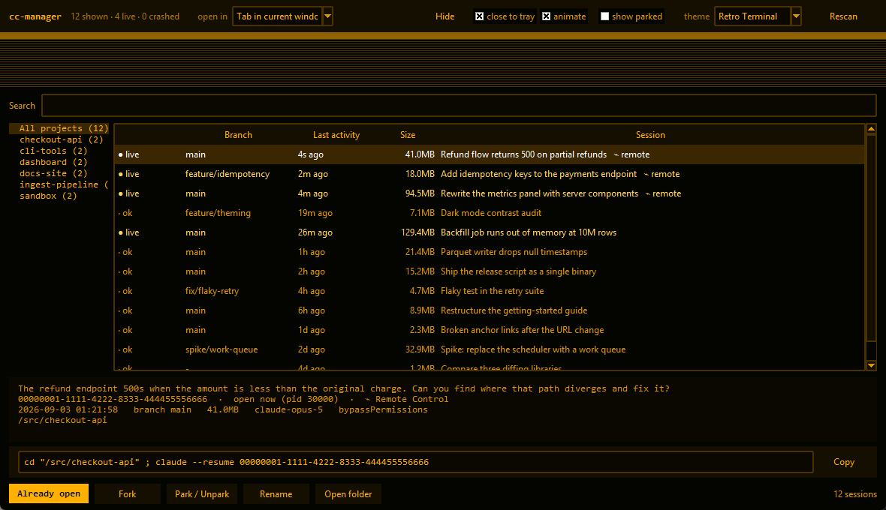

# cc-manager

A dashboard for the Claude Code sessions on your machine — browse them, search
them, see which are still running, and reopen one in a terminal with a
double-click.

Claude Code writes every session to `~/.claude/projects/<encoded-cwd>/<id>.jsonl`.
cc-manager reads those transcripts and turns them into something you can
actually navigate.



There are three ways in: a desktop app, a terminal UI, and plain CLI output.

---

## Install

Put both launchers on your PATH. No shell profile is involved, and it works
from Windows PowerShell, pwsh, `cmd` and git-bash alike.

```powershell
copy "$HOME\.claude\tools\cc-manager\cc-manager.cmd"     "$HOME\.local\bin\"
copy "$HOME\.claude\tools\cc-manager\cc-manager-gui.cmd" "$HOME\.local\bin\"
copy "$HOME\.claude\tools\cc-manager\cc-manager"         "$HOME\.local\bin\"
```

`%USERPROFILE%\.local\bin` is already on PATH if you installed Claude Code
natively. Three files because the shells disagree about what is executable:
PowerShell and `cmd` resolve `.cmd` through `PATHEXT`, git-bash ignores
`PATHEXT` and needs an exact, extensionless name. They do not conflict.

On macOS / Linux:

```sh
ln -s ~/.claude/tools/cc-manager/cc-manager ~/.local/bin/cc-manager
chmod +x ~/.claude/tools/cc-manager/cc-manager
```

> **Shell profiles instead?** Windows PowerShell 5.1 and PowerShell 7 read
> *different* profiles — `Documents\WindowsPowerShell\` and
> `Documents\PowerShell\`. Writing to `$PROFILE` from a pwsh 7 session does
> nothing for a 5.1 terminal, which is the usual reason `cc-manager` still
> comes back "not recognized". `$PSVersionTable.PSVersion` says which you are in.

### Standalone executable

```sh
python make_icon.py     # writes cc_manager.ico
python build_exe.py     # writes dist/CCManager/CCManager.exe
```

Worth doing if you want to pin it. Run as a script, the GUI is `pythonw.exe`
as far as Windows is concerned, so the taskbar groups it with every other
Python app under one generic icon and pinning pins the interpreter. The
executable — plus an explicit AppUserModelID the app sets at startup — gives it
its own identity.

Requires Python 3.10+, `pystray` for the tray, and `pyinstaller` to build.

---

## The desktop app

```sh
cc-manager-gui        # or: cc-manager --gui
```

Projects on the left, that project's sessions on the right, newest first.
**Double-click** a session to open it in a terminal running `claude --resume`,
in its original directory.

### Opening sessions

The **open in** dropdown decides where a session lands:

| Mode | What it does |
| --- | --- |
| **Tab in current window** *(default)* | `wt -w 0 new-tab` — a tab in the Windows Terminal window you are already using |
| Tab in cc-manager window | A dedicated named window that every launch joins |
| New window | A separate Windows Terminal window |
| Isolated window | A private conhost per session |
| PowerShell 7 | pwsh in its own window |

Windows Terminal is single-instance by default, so asking for a new *window*
still puts every session in one process. If that process wedges, all of them
appear to hang at once. **Isolated window** is the escape hatch: one frozen
window cannot take the others down with it.

The command for the selected session is shown in a field at the bottom with a
**Copy** button, so you can run it in a terminal you already have set up
instead of letting cc-manager open one.

### Right-click a session

Open as a tab here / in the cc-manager window / in a new window · Fork ·
Park / Unpark · Rename · Copy session id · Copy resume command · Copy with `cd`
· Open folder · **Remote Control** → jump to the session on claude.ai when
connected, or toggle auto-connect for every new session.

### Not opening the same session twice

A launched session takes several seconds to appear in `~/.claude/sessions`, so
liveness alone would let a second double-click through in the gap. Launches are
tracked locally and expire once the registry is authoritative. An already-open
session shows `● live` or `◌ opening`, the button greys to **Already open**,
and the open actions are disabled. Forking is still allowed — that is a
deliberate copy.

### Tray

**Hide** parks the window in the notification area, and the X does the same
unless you untick **close to tray**. The tray menu has Show, Rescan and Quit —
Quit is the one that really exits. The animation stops entirely while hidden.

---

## Themes

Five, picked from the dropdown and remembered across launches. Surface hues
follow the chiptune tracker's own palettes so the two apps agree.

Every palette is contrast-checked rather than eyeballed: the tests assert a
**4.5:1** ratio for text on every surface it is actually drawn on, and 3:1 for
the status colours. Several first-draft values failed and were retuned.

### Matrix



Falling rain in mostly half-width katakana and digits, as in the film. The
heavy symbols `@ # $ % &` are deliberately absent — uniform picking made them
read as blobs rather than code.

### Synthwave



A slitted sun over a perspective grid that scrolls toward you, with light
chasers sweeping the horizon.

### Frutiger Aero



Glossy bubbles rising over two layers of swaying grass. A light theme, so the
accent button and selected rows get their own foregrounds rather than assuming
white text.

### Retro Terminal



Amber phosphor, scanlines and a rolling sweep.

### Animation

The banner is a strip along the top rather than a true background. tkinter
widgets are opaque and cannot be composited over a canvas, so a full-window
background would simply be hidden behind the panels. (The chiptune tracker
draws to ImGui's background draw list, which composites behind the whole UI —
tkinter has no equivalent.)

It pauses whenever the window is not focused, is minimised, or is in the tray,
which takes it to under 1% of one core. Focused, the busiest themes cost
20–24%; the **animate** checkbox turns it off entirely.

---

## Session state

Every row carries a state, and this is the part that matters after a machine
dies without a clean `/quit`:

| | Meaning |
| --- | --- |
| `● live` | Running right now. Resuming collides with the running copy, so cc-manager asks first and suggests forking. |
| `⚠ crashed` | Ended uncleanly — crash, killed terminal, power loss. |
| `◐ stopped` | Stopped mid-turn: a prompt never answered, or a tool call that never returned. |
| `· ok` | Closed normally. |
| `⏸ parked` | Shelved (see below). |
| `◌ opening` | Just launched, not yet registered. |

Detected two ways, both of which survive a power cut:

- Claude Code registers each live session as `~/.claude/sessions/<pid>.json` and
  deletes it on a clean exit. A leftover file whose process is gone means that
  session never shut down. PID reuse is accounted for — the process must still
  actually be `claude`.
- A transcript whose final line is half-written JSON was being appended to when
  the power went. That partial line is detected, reported, and never treated as
  data.

`cc-manager --doctor` lists them with the exact command to recover each, and
`--doctor --prune-stale` clears orphaned registry files afterwards.

Nothing is cached between runs. Every launch, every **Rescan**, and an
automatic refresh every 20 seconds re-read the directory from scratch, so
sessions written by your other terminals always show up.

---

## Park and unpark

Parking shelves a session you are done with but do not want to delete.

- **hides it** from the default view (the **show parked** checkbox reveals them)
- **renames it** to `parked-<name>`, so it is labelled that way in Claude Code's
  own `/resume` picker too
- **remembers the old title**, so unparking puts it back

There is no `claude --rename` flag, so the rename appends a `custom-title`
record to the transcript — the mechanism Claude Code uses internally. The last
such record wins, so it is a pure append: no existing byte is rewritten and
nothing is deleted. The session resumes exactly as before either way.

cc-manager also keeps its own list at `~/.claude/cc-manager/parked.json`.
Use `--safe` if you would rather it never touch transcripts; parking then lives
only in that sidecar.

---

## Background sessions

A session started with `claude --bg` refuses `--resume` while it is running —
Claude Code answers `/resume` on one with *"Run `claude attach <id>` to open
it, or `claude stop <id>` first"*. cc-manager reads `kind` and `jobId` from the
registry, so those sessions report and launch `claude attach <job id>` instead,
and are exempt from the already-open guard: a background job has no terminal,
so attaching is always valid.

---

## Model and permission mode

The detail pane shows what each session was actually using. A resumed session
restores its own recorded permission mode, so the global default in
`settings.json` is not by itself proof of what a given session runs — anything
not matching the configured default is flagged rather than shown as if it
agreed.

cc-manager deliberately does **not** pass `--model` when launching. If your
configured model is `opus[1m]`, the CLI's documented `opus` alias would quietly
drop the 1M context window. `settings.json` governs it correctly already.

---

## Environment

Claude Code injects per-session state into the environment of everything it
spawns. If cc-manager is itself started from inside a session, those markers
would be inherited by the session it launches, which then believes it is our
child:

```
CLAUDECODE                     CLAUDE_CODE_MESSAGING_SOCKET
CLAUDE_CODE_CHILD_SESSION      CLAUDE_CODE_MESSAGING_TOKEN
CLAUDE_CODE_SESSION_ID         CLAUDE_CODE_ENTRYPOINT
CLAUDE_CODE_BRIDGE_SESSION_ID  CLAUDE_CODE_EXECPATH
CLAUDE_PID                     CLAUDE_EFFORT
```

`CLAUDE_CODE_CHILD_SESSION=1` is the damaging one: the session runs normally
but **records nothing**, and never registers, so it is invisible to liveness
checks too. `NO_COLOR=1` and a stale `WT_SESSION` are stripped for the same
reason — the first turns off all syntax highlighting, the second hands a new
terminal the old one's identity. Windows Terminal launches are also told
`COLORTERM=truecolor`, which it supports but does not advertise.

All of these are process-scoped markers, never user configuration, so removing
them discards nothing deliberate. `CC_MANAGER_KEEP_ENV=1` inherits verbatim.

---

## Terminal UI

```sh
cc-manager
```

Same data, in the terminal.

| Key | Action |
| --- | --- |
| `↑` `↓` | Move |
| `Enter` | Resume in this terminal |
| `f` | Fork |
| `p` | Park / unpark |
| `n` | Rename |
| `v` | Cycle view: active → parked → all |
| `a` | Toggle all projects |
| `r` | Rescan |
| `/` | Search |
| `c` | Copy session id |
| `q` | Quit |

## Command line

```sh
cc-manager --list                 # plain listing
cc-manager --json                 # machine-readable
cc-manager --tail circuit -n 30   # read a session's recent output
cc-manager --doctor               # sessions that ended uncleanly
cc-manager --resume-last          # jump back into the newest
cc-manager --all                  # every project
cc-manager -C /some/path          # act as if run from elsewhere
cc-manager --safe                 # never write to transcripts
```

`--tail` is the one worth knowing about: it reconstructs a session's recent
conversation from disk, so you can read what a session was doing when its
terminal is gone or frozen.

---

## How the metadata is derived

| Field | Source |
| --- | --- |
| Session id | The transcript filename |
| Last activity | Newest `timestamp` in the file, falling back to file mtime (still correct after a power cut) |
| Branch | The `gitBranch` recorded on each message. Claude Code writes a bare `HEAD` both for a detached head *and* for a directory that is not a repo, so cc-manager checks for a `.git` work tree to tell those apart and shows `-` when there is no repository |
| Summary | The first thing you actually typed, cut to one or two sentences; a `custom-title` or `ai-title` record is preferred when present |

"The first thing you typed" is narrower than "the first user record":
transcripts also store tool results, hook output, slash-command expansions,
task notifications, caveats and pasted-image markers as user turns. Those are
filtered out.

## Performance

Transcripts get large — half a gigabyte for a long session is normal. Nothing
here ever reads a whole file. Each session is summarised from a **head scan**
that stops at the first human prompt and a **tail scan** of the last few
hundred kilobytes, across a thread pool.

Scanning 35 transcripts totalling 1.3 GB takes about one second.

## Settings

`~/.claude/cc-manager/gui.json` — theme, terminal mode, show-parked,
close-to-tray, animation, selected project, and window geometry. Geometry is
validated on the way back in: a position saved on a monitor that is no longer
attached falls back to a centred default.

| Variable | Effect |
| --- | --- |
| `CLAUDE_CONFIG_DIR` | Use a different Claude Code config directory |
| `CC_MANAGER_CLAUDE_BIN` | Full path to `claude`, if not on PATH |
| `CC_MANAGER_PYTHON` | Interpreter the launchers should use |
| `CC_MANAGER_KEEP_ENV` | `1` to inherit the environment verbatim |

## Tests

```sh
python tests/test_cc_manager.py   # parsing, crash detection, park round-trip
python tests/test_tui.py          # headless terminal UI
python tests/test_gui.py          # window, themes, contrast, tray, launching
```

They run against the real session store and build a real window, so they check
what the app actually does rather than a mock of it.

## Layout

```
cc_manager/
  paths.py      cwd -> project-directory encoding, transcript discovery
  parser.py     bounded head/tail JSONL parsing -> SessionMeta, end-state detection
  registry.py   ~/.claude/sessions/<pid>.json -> live, crashed, background, remote
  scanner.py    transcripts + liveness + park state + git context
  park.py       park / unpark / rename via appended custom-title records
  launcher.py   building and spawning terminal commands, environment scrubbing
  config.py     allow-listed writes to Claude Code's settings.json
  banner.py     the animated theme strip
  tray.py       notification-area icon
  gui.py        the desktop window
  app.py        the terminal UI
  cli.py        argument parsing and non-TUI output
make_icon.py         draws the app icon (multi-resolution .ico)
build_exe.py         builds CCManager.exe
tools/capture_themes.py   regenerates the screenshots above
```
